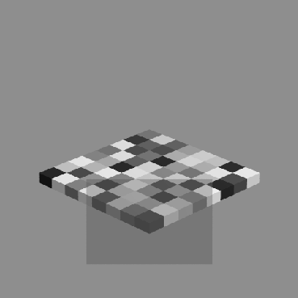
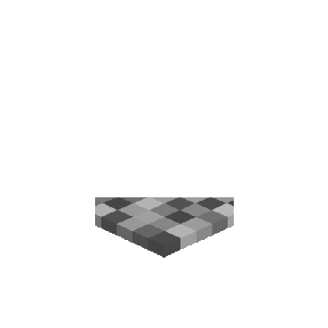
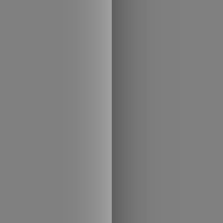
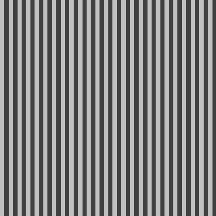

# Contrast Measures
Various function that calculate contrast metrics.

### Example usage

```python
from stimuli import contrast_metrics as cm
from stimuli.transparency import CheckerboardFactory

f = CheckerboardFactory()
f.find_checkerboard(8)
f.build_image(1, .5)
img, mask = f.get_checkerboard(return_mask=True)
```
Checkerboard (left) and only the masked region (right):




This computes the average of all pair-wise Michelson Contrasts between unique luminance values in the
masked region of the image:
```python
cm.SAM(img, mask=(mask==1), mode="unique")
```
Available Metrics:
- SAM: Space Average Michelson Contrast
- SAMLG: SAM of log luminances
- SDMC: Standard Deviation of pair-wise Michelson Contrasts
- SAW: Space Average Whittle Contrast
- SAWLG: SAW of log luminances
- RMS: Root Mean Sqaure Contrast
- SD: Standard Deviation of luminances
- SDLG: SD of log luminances

# Lightness
This submodule contains functions for creating common stimuli used in
lightness/brightness research as numpy arrays (or save them as raster art).

All stimuli are freely parameterizable, see docstrings of individual functions
for details.


### Example usage
```python
from stimuli import lightness
import matplotlib.pyplot as plt
```
#### Cornsweet / Todorovic


```python
a = lightness.cornsweet((10, 10), 10, .5)
b = lightness.todorovic(a, 2, 2)

plt.figure()
plt.imshow(a, vmin=0, vmax=1, cmap='gray')
plt.show()
plt.figure()
plt.imshow(b, vmin=0, vmax=1, cmap='gray')
plt.show()

```
#### Square Wave

```python
c = lightness.square_wave((10, 10), 10, .5, 2)

plt.figure()
plt.imshow(c, vmin=0, vmax=1, cmap='gray')
plt.show()

```
#### White's Illusion BMCC


```python
d = lightness.whites_illusion_bmcc((10, 10), 10, .5, 2)
e1, e2 = lightness.contours_white_bmmc((10, 10), 10, .5, 2, contour_width=3)

plt.figure()
plt.imshow(d, vmin=0, vmax=1, cmap='gray')
plt.show()
plt.figure()
plt.imshow(e1, vmin=0, vmax=1, cmap='gray')
plt.show()
plt.figure()
plt.imshow(e2, vmin=0, vmax=1, cmap='gray')
plt.show()

```
#### White's Illusion Gil

```python
f = lightness.whites_illusion_gil((10, 10), 10, .5, 2)

plt.figure()
plt.imshow(f, vmin=0, vmax=1, cmap='gray')
plt.show()

```
#### Disc and Ring

```python
g = lightness.disc_and_ring((10, 10), [4, 2], [0.5, 1.])

plt.figure()
plt.imshow(g, vmin=0, vmax=1, cmap='gray')
plt.show()
```

# Utils
Helper functions for padding, resizing, computing Munsell values, and
converting pixel values to degrees of visual angle.
