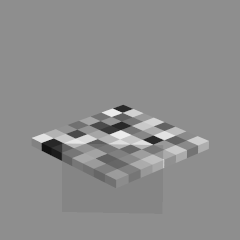
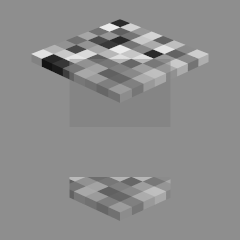
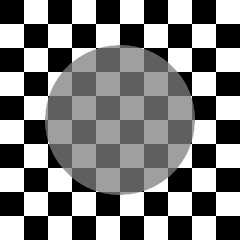
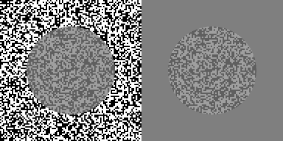

# Checkerboard [Factory](https://en.wikipedia.org/wiki/Factory_%28object-oriented_programming%29)
Creates images of 3-dimensional checkerboards and optionally a transparent rectangle covering a part of the board. It renders using [povray](http://www.povray.org/).




### Requires
- [povray](http://www.povray.org/).

### Example Usage
```python
# 1. Basic functionality
reflectances = [0.06, 0.11, 0.19, 0.31, 0.46, 0.63, 0.82, 1.05, 1.29, 1.50, 1.67, 1.95, 2.22]

f = CheckerboardFactory()

# sets-up a n-dimensional checkerboard with contrain that neighooring checks cannot be equal.
f.find_checkerboard(n_checks=8, reflectances = reflectances)

# render an image, including the transparency in front
tau = 2  # transparency's reflectance, in povray units
alpha = .5 # transparency's transmittance

f.build_image(tau, alpha)

# get the rendered image and shows
checkerboard = f.get_checkerboard()
plt.figure(); plt.imshow(checkerboard, cmap='gray', vmin=0, vmax=1); plt.axis('off'); plt.show()

# 2. Cut-out region of transparency
# get the checkarboard and cut-out region stacked
stacked = f.get_stacked()
plt.figure(); plt.imshow(stacked, cmap='gray', vmin=0, vmax=1); plt.axis('off'); plt.show()

# 3. Moving the camera to the right (but keep constant the look_at point)
f.build_image(tau, alpha, camera_offset=(2, 0, 0), look_at_offset=(0, 0, 0))
# when offsets are specified, only get_checkerboard may be used
img1 = f.get_checkerboard()
plt.figure(); plt.imshow(img1, cmap='gray', vmin=0, vmax=1); plt.axis('off'); plt.show()

# See more functionalities in docstrings:
# CheckerboardFactory.find_checkerboard?
# CheckerboardFactory.build_image?

```

# Texture [Factory](https://en.wikipedia.org/wiki/Factory_%28object-oriented_programming%29)
Create 2-dimensional textures with an optional transparent circle covering the center.

Supports random textures and checkerboard patterns.





### Example Usage
```python
# compute texture with a checkerboard pattern with n checks per side
n = 10
image_width = 480
block_width = image_width // n
f = TextureFactory('checkerboard', block_width, image_width=image_width)

# add a transparent circle layer to the image
tau = .5
alpha = .25
img1 = f.get_image(tau, alpha)

# cut out the circle and set it against a background of given luminance
img2 = f.get_image(tau, alpha, bg_luminance=.5)

plt.figure(); plt.imshow(img1, cmap='gray', vmin=0, vmax=1); plt.axis('off'); plt.show()
plt.figure(); plt.imshow(img2, cmap='gray', vmin=0, vmax=1); plt.axis('off'); plt.show()

# compute random texture for a given size
f = TextureFactory('random', block_width=5, image_width=image_width)

# get a stacked version of the texture plus the cutout
img_r = f.get_image(tau, alpha, bg_luminance=.5, stack_option='horizontal')

plt.figure(); plt.imshow(img_r, cmap='gray', vmin=0, vmax=1); plt.axis('off'); plt.show()
```

### Requires
- Numpy