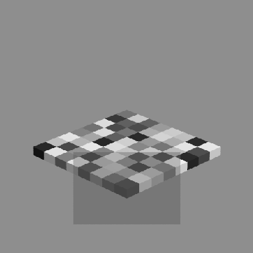
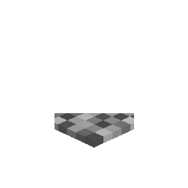

# Contrast Metrics
Various function that calculate contrast metrics.

### Example usage

```python
from stimuli import contrast_metrics as cm
from stimuli.transparency import CheckerboardFactory

f = CheckerboardFactory()
f.find_checkerboard(8)
f.build_image(1, .5)
img, mask = f.get_checkerboard(return_mask=True)
```
Checkerboard (left) and only the masked region (right):




This computes the average of all pair-wise Michelson Contrasts between unique luminance values in the
masked region of the image:
```python
cm.SAM(img, mask=(mask==1), mode="unique")
```
Available Metrics:
- SAM: Space Average Michelson Contrast
- SAMLG: SAM of log luminances
- SDMC: Standard Deviation of Michelson Contrasts between all pairs of values
- SAW: Space Average Whittle Contrast
- SAWLG: SAW of log luminances
- SD: Standard Deviation of luminances
- SDLG: SD of log luminances
- RMS: RMS Contrast, defined as standard_deviation(luminances)/mean(luminances)

Definitions:
- Michelson Contrast between values a and b: |(a-b)/(a+b)|
- Whittle Contrast between values a and b: |(a-b)/min(a,b)|
- Space Average Contrast: mean of contrasts between all pairs of values
- Log luminances: contrast is computed on log_10(luminances)
