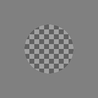

# Checkerboard Factory
Create images of 3-dimensional checkerboards and optionally a transparent rectangle covering a part of the board.


### Example Usage
```
f = CheckerboardFactory()
# calculate a n-dimensional pattern
n = 8
f.find_checkerboard(n)

# render an image, including transparent rectangle
tau = 2
alpha = .5
f.build_image(tau, alpha, background=.5)
# get a comparable stacked version of the original image and a cutout of the board-transparency intersection
img1 = f.get_stacked()

plt.figure()
plt.imshow(img1, cmap='gray', vmin=0, vmax=1)
plt.show()

# move the camera to the right (but keep look_at point constant) before rendering
f.build_image(0, 1, camera_offset=(5, 0, 0), look_at_offset=(0, 0, 0))
# when offsets are specified, only get_checkerboard may be used
img1 = f.get_checkerboard()

plt.figure()
plt.imshow(img1, cmap='gray', vmin=0, vmax=1)
plt.show()
```

### Requires
- PovRay
- PIL
- Numpy

# Texture Factory
Create 2-dimensional textures with an optional transparent circle covering layered over the center.

Supports random textures and alternating checkerboard patterns.




### Example Usage
```
# compute texture with n-dimensional checkerboard pattern
    n = 10
    image_width = 480
    block_width = image_width // n
    f = TextureFactory('checkerboard', block_width, image_width=image_width)

    # add a transparent circle layer to the image
    tau = .5
    alpha = .25
    img1 = f.get_image(tau, alpha)
    # cut out the circle and set it against a background of given luminance
    img2 = f.get_image(tau, alpha, bg_luminance=.5)

    plt.figure()
    plt.imshow(img1, cmap='gray', vmin=0, vmax=1)
    plt.show()
    plt.figure()
    plt.imshow(img2, cmap='gray', vmin=0, vmax=1)
    plt.show()

    # compute random texture of blocks with given size
    block_width = 10
    f = TextureFactory('random', block_width, image_width=image_width)
    # get a comparable stacked version of original and cutout
    img = f.get_image(1, .5, bg_luminance=.5, stack_option='horizontal')

    plt.figure()
    plt.imshow(img, cmap='gray', vmin=0, vmax=1)
    plt.show()
```

### Requires
- Numpy